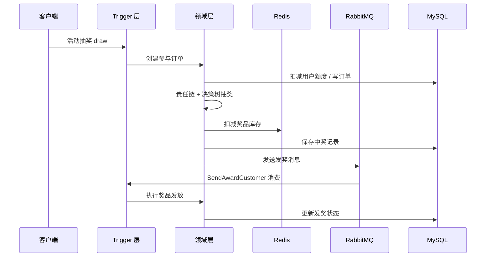

# Big Market — 大营销抽奖系统

基于 **DDD（领域驱动设计）** 架构的营销抽奖平台，提供活动抽奖、策略引擎、奖品发放、行为返利、积分兑换等完整业务能力。项目采用 Maven 多模块拆分，适用于高并发场景下的抽奖营销活动。

---

## 项目简介

Big Market 是一套可扩展的 **抽奖营销后端服务**，核心解决以下问题：

- **灵活配置抽奖策略**：支持责任链 + 决策树组合规则，实现黑名单、权重、库存、解锁等多维度抽奖控制
- **活动全生命周期管理**：活动预热、SKU 库存、用户额度（日/月/总）、参与下单、异步发奖
- **用户激励体系**：日历签到返利、积分账户、积分兑换商品
- **高可用基础设施**：分库分表、Redis 缓存与分布式锁、RabbitMQ 异步解耦、XXL-JOB 定时补偿

默认服务端口：**8091**，API 版本前缀：`/api/v1`

---

## 核心功能

### 1. 抽奖活动

| 功能 | 说明 |
|------|------|
| 活动装配（预热） | 将活动 SKU 库存、抽奖策略等数据加载至 Redis，提升抽奖性能 |
| 活动抽奖 | 创建参与订单 → 执行抽奖策略 → 保存中奖记录 → 异步 MQ 发奖 |
| 用户活动账户 | 查询用户在活动下的总额度、日额度、月额度及剩余次数 |
| 降级开关 | 通过 Nacos 动态配置 `degradeSwitch`，一键关闭抽奖入口 |
| 接口限流 | 基于 Redisson 的令牌桶限流，支持黑名单机制，防止恶意刷接口 |

### 2. 抽奖策略引擎

抽奖策略采用 **「责任链（抽奖前） + 决策树（抽奖中） + 概率表（抽奖后）」** 三层模型：

**责任链（Logic Chain）**

- `rule_blacklist` — 黑名单规则，命中后直接返回指定奖品
- `rule_weight` — 权重规则，根据用户累计抽奖次数匹配不同奖品池
- `default` — 默认概率抽奖，兜底处理

**决策树（Logic Tree）**

- `rule_lock` — 奖品解锁规则，按当日参与次数控制奖品是否可中
- `rule_stock` — 奖品库存规则，控制奖品消耗上限
- `rule_luck_award` — 兜底奖品规则，库存耗尽时发放安慰奖

**策略装配**

- 支持按 `strategyId` 或 `activityId` 预热策略数据至 Redis
- 奖品库存采用 Redis 原子扣减 + 延迟队列异步落库

### 3. 奖品发放

- 抽奖成功后写入用户中奖记录，通过 RabbitMQ（`send_award`）异步触发发奖
- 支持多种发奖策略（如 `user_credit_random` 随机积分奖品）
- 发奖失败可通过任务表 + 定时任务重试

### 4. 行为返利

- **日历签到返利**：用户每日签到触发行为返利订单，异步发放 SKU 次数或积分
- 支持查询当日是否已签到
- 返利类型：`sku`（增加抽奖次数）、`integral`（增加积分）

### 5. 积分体系

- 积分账户查询
- 积分兑换 SKU 商品（创建待支付订单 → 扣减积分 → MQ 通知发货）
- 积分调整成功消息驱动商品履约

### 6. 定时任务（XXL-JOB）

| 任务名称 | 说明 |
|----------|------|
| `UpdateAwardStockJob` | 消费 Redis 延迟队列，异步更新奖品消耗库存 |
| `UpdateActivitySkuStockJob` | 异步更新活动 SKU 库存 |
| `SendMessageTaskJob_DB1/DB2` | 扫描任务表，补偿重发失败的 MQ 消息 |

---

## 系统架构

### 模块划分（DDD 分层）

```
big-market/
├── big-market-api            # 对外 API 接口定义与 DTO
├── big-market-app            # 应用启动层：Spring Boot 入口、配置、AOP
├── big-market-domain         # 领域层：核心业务逻辑与领域模型
├── big-market-infrastructure # 基础设施层：仓储实现、DAO、MQ 事件发布
├── big-market-trigger        # 触发器层：HTTP 接口、MQ 消费者、定时任务
└── big-market-types          # 通用类型：枚举、异常、注解、事件基类
```

### 领域模块

| 领域 | 职责 |
|------|------|
| `activity` | 活动参与、SKU 商品、账户额度、库存管理 |
| `strategy` | 抽奖策略、责任链、决策树、概率表、奖品库存 |
| `award` | 中奖记录、奖品发放 |
| `rebate` | 用户行为返利（签到等） |
| `credit` | 积分账户与交易 |
| `task` | MQ 发送任务补偿 |

### 业务流转



---

## 技术栈

| 类别 | 技术 |
|------|------|
| 基础框架 | Spring Boot 2.7.12、Java 8 |
| 持久层 | MyBatis、MySQL 8.x |
| 分库分表 | db-router-spring-boot-starter（按 userId 路由，2 库 × 4 表） |
| 缓存 / 锁 | Redis、Redisson |
| 消息队列 | RabbitMQ |
| 定时任务 | XXL-JOB 2.4.1 |
| 动态配置 | Nacos Client |
| 监控 | Spring Actuator、Prometheus |
| 日志 | Logback + Logstash Encoder |
| 工具库 | Hutool、Guava、Fastjson、Lombok |

---

## API 接口概览

### 活动接口 — `/api/v1/raffle/activity/`

| 方法 | 路径 | 说明 |
|------|------|------|
| GET | `armory` | 活动数据预热 |
| POST | `draw` | 活动抽奖（限流保护） |
| POST | `calendar_sign_rebate` | 日历签到返利 |
| POST | `is_calendar_sign_rebate` | 查询今日是否已签到 |
| POST | `query_user_activity_account` | 查询用户活动账户额度 |
| POST | `query_user_credit_account` | 查询用户积分 |
| POST | `query_sku_product_list_by_activity_id` | 查询活动 SKU 商品列表 |
| POST | `credit_pay_exchange_sku` | 积分兑换商品 |

### 策略接口 — `/api/v1/raffle/`

| 方法 | 路径 | 说明 |
|------|------|------|
| GET | `strategy_armory` | 策略数据预热 |
| POST | `query_raffle_award_list` | 查询奖品列表（含解锁状态） |
| POST | `random_raffle` | 随机抽奖（策略维度） |
| POST | `query_raffle_strategy_rule_weight` | 查询权重规则配置 |

---

## 消息队列 Topic

| Topic | 用途 |
|-------|------|
| `send_award` | 异步发放奖品 |
| `send_rebate` | 行为返利（SKU / 积分） |
| `credit_adjust_success` | 积分扣减成功后触发商品发货 |
| `activity_sku_stock_zero` | 活动 SKU 库存耗尽通知 |

---

## 快速开始

### 环境要求

- JDK 8+
- Maven 3.6+
- MySQL 8.x（需准备 `big-market`、`big-market-01`、`big-market-02` 等分库）
- Redis
- RabbitMQ
- XXL-JOB Admin（可选，用于定时任务）

### 本地启动 MySQL（Docker）

```bash
cd docs/dev-ops/mysql
docker-compose up -d
```

> 首次启动会将 `docs/dev-ops/mysql/sql/` 下的 SQL 脚本自动导入数据库。

### 配置修改

编辑 `big-market-app/src/main/resources/application-dev.yml`，按本地环境修改：

- MySQL 连接地址与账号密码
- Redis 地址
- RabbitMQ 地址与虚拟主机
- XXL-JOB Admin 地址

### 编译与运行

```bash
# 根目录编译
mvn clean install -DskipTests

# 启动应用
cd big-market-app
mvn spring-boot:run
```

或在 IDE 中直接运行 `com.flocier.Application`。

### Docker 部署

```bash
# 构建镜像（需先 mvn package）
docker build -t big-market:1.0-SNAPSHOT -f big-market-app/Dockerfile big-market-app/

# 使用 docker-compose 启动
cd docs/dev-ops/app
docker-compose -f docker-compose-1.0.yml up -d
```

---

## 项目结构说明

```
big-market/
├── big-market-api/
│   └── trigger/api/              # IRaffleActivityService、IRaffleStrategyService 及 DTO
├── big-market-app/
│   ├── Application.java          # 启动类
│   ├── config/                   # Redis、线程池、XXL-JOB 等配置
│   ├── aop/RateLimiterAOP.java   # 接口限流切面
│   └── resources/
│       ├── application-dev.yml   # 开发环境配置
│       ├── application-prod.yml  # 生产环境配置
│       └── mybatis/mapper/       # MyBatis XML 映射
├── big-market-domain/
│   └── domain/
│       ├── activity/             # 活动、额度、SKU、参与
│       ├── strategy/             # 策略、责任链、决策树
│       ├── award/                # 发奖
│       ├── rebate/               # 返利
│       ├── credit/               # 积分
│       └── task/                 # 任务补偿
├── big-market-infrastructure/
│   └── persistent/               # DAO、PO、Repository 实现
├── big-market-trigger/
│   ├── http/                     # REST Controller
│   ├── listener/                 # RabbitMQ 消费者
│   └── job/                      # XXL-JOB 定时任务
├── big-market-types/
│   └── types/                    # 枚举、异常、注解、通用模型
└── docs/dev-ops/                 # Docker、SQL 等运维资源
```

---

## 设计亮点

1. **DDD 分层清晰**：领域逻辑与基础设施解耦，便于扩展与测试
2. **规则引擎可配置**：责任链 + 决策树支持数据库动态配置，无需改代码即可调整抽奖规则
3. **高性能抽奖**：Redis 预热 + 原子库存扣减，数据库异步落库
4. **可靠消息投递**：本地消息表 + 定时任务补偿，保证 MQ 消息最终一致
5. **分库分表**：基于 `userId` 路由，支撑海量用户数据
6. **运维友好**：限流、降级开关、Prometheus 指标、Logstash 日志采集

---

## 许可证

[Apache License 2.0](https://www.apache.org/licenses/LICENSE-2.0)
